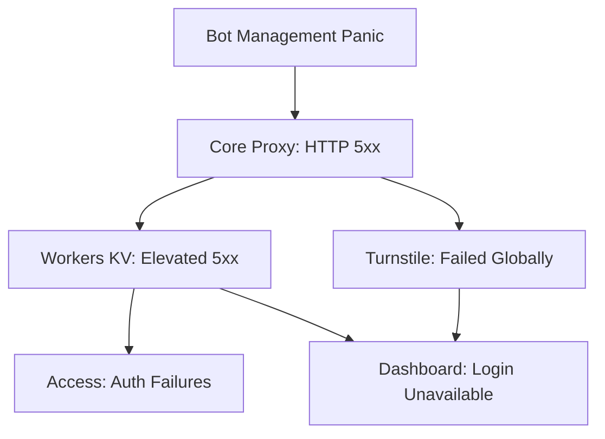

import Callout from '@/components/Callout.astro'

<Callout variant="tip">
**Part 2 of 3**: This is part of a series analyzing Cloudflare's November 18, 2025 outage. [← Part 1: Technical Root Cause](/blog/cloudflare-outage-nov-2025/technical-deep-dive) | [Part 3: Lessons Learned →](/blog/cloudflare-outage-nov-2025/lessons-learned)
</Callout>

## How One Module Brought Down the CDN

The Bot Management module failure didn't stay contained. It cascaded through Cloudflare's architecture like dominos falling:



Let's examine each cascade in detail.

## The Downstream Cascades

### 1. Core Proxy → HTTP 5xx Errors

When the Bot Management module panicked, the entire request processing failed:

- **FL2 customers**: Received HTTP 5xx errors directly
- **FL customers**: Bot scores set to 0, causing false positives on bot-blocking rules
- **Global impact**: Any customer using Bot Management affected

The impact chart showed a dramatic spike in 5xx errors - from near-zero baseline to massive error rates.

### 2. Workers KV Impact

**Workers KV**: Cloudflare's distributed key-value store used by millions of applications.

**Why it failed**: Workers KV relies on the core proxy for request handling. When the proxy failed, Workers KV couldn't process requests.

**Symptoms**:
- Elevated HTTP 5xx error rate from 11\:28 onwards
- Initial diagnosis focused here (red herring!)
- Team attempted traffic manipulation and account limiting

**Mitigation at 13\:05**: Bypassed the failing FL2 proxy, impact reduced significantly.

### 3. Cloudflare Access Failures

**Access**: Zero Trust authentication service protecting applications.

**Why it failed**: Depends on both the core proxy AND Workers KV.

**Impact**:
- **Widespread authentication failures** from 11\:28-13\:05
- Existing sessions continued working (not invalidated)
- New login attempts resulted in error pages
- **Failed closed, not open**: No incorrect authentications succeeded

**Critical**: Users never reached target applications during failed auth - error boundary prevented access.

### 4. Dashboard Login Unavailable

**Why it failed**: The Cloudflare Dashboard requires:
-Turnstile on the login page (failed)
- Workers KV for internal operations (failed initially, then bypassed)

**Impact timeline**:
- **11\:30-13\:10**: First period of unavailability (Turnstile down)
- **13\:10**: Workers KV bypass restored partial functionality
- **14\:40-15\:30**: Second period - login backlog overwhelmed control plane
- **15\:30**: Resolved by scaling control plane concurrency

The second failure was particularly interesting: after the main fix, a backlog of login attempts (plus retries) overwhelmed the dashboard infrastructure.

### 5. Turnstile Global Failure

**Turnstile**: Cloudflare's CAPTCHA alternative used on millions of websites.

**Why it failed**: Runs on the core proxy.

**Impact**:
- Failed to load globally
- Blocked all dashboard logins
- Affected customer websites using Turnstile

## The Red Herrings

Several factors made diagnosis exceptionally difficult:

### Red Herring #1: The Status Page Coincidence

At **11\:28 UTC**, exactly when the outage started, Cloudflare's status page (hosted **completely off Cloudflare's infrastructure**) also went down.

**What the team thought**: "This must be a coordinated attack targeting both our systems and our status page!"

**Reality**: Pure coincidence. Unrelated issue with their status page provider.

**Impact on diagnosis**: Led some team members to suspect external attack rather than internal misconfiguration.

### Red Herring #2: DDoS Attack Suspicion

Cloudflare had recently defended against:
- **7.3 Tbps DDoS** in September 2024
- Multiple record-breaking attacks in months prior
- Constant high-volume attack patterns

**What the pattern looked like**:
- Intermittent failures (5-minute cycles)
- Widespread impact across services
- Status page down simultaneously

**Team discussion** (from internal chat):
> "Could this be another Aisuru-class attack? The intermittent pattern matches volumetric DDoS..."

**Reality**: Internal configuration issue with predictable cycles.

### Red Herring #3: Workers KV as Root Cause

**Initial symptoms** pointed to Workers KV:
- Elevated 5xx error rates
- Access failures (depends on Workers KV)
- Dashboard issues (uses Workers KV)

**Investigation efforts** from 11\:32-13\:05:
- Traffic manipulation attempts
- Account limiting
- Capacity analysis
- Network path examination

**The breakthrough**: Workers KV bypass at 13\:05 **reduced** impact but didn't solve the root cause, proving Workers KV was a symptom, not the cause.

## The Diagnosis Timeline: A Detective Story

Let's walk through the team's perspective minute by minute:

### 11\:35 - Initial Symptoms

```
Observations:
- Workers KV: elevated 5xx errors
- Access: authentication failures
- Core CDN: intermittent errors
- Status page: DOWN (!!!)

Hypothesis: DDoS attack targeting multiple systems
Actions: Traffic manipulation, rate limiting
Result: ❌ No improvement
```

**Why this made sense**: Recent DDoS history, intermittent pattern, external symptoms (status page).

### 12\:00 - Pattern Recognition

```
Observations:
- Errors surge every ~5 minutes
- Not sustained (typical of DDoS)
- Not stable (typical of code deploy)
- Fluctuating between working and broken

Hypothesis: Intermittent network issue?
Actions: Check routing, examine network paths
Result: ❌ Network looks healthy
```

**The confusion**: Intermittent failures are rare for internal issues. Most config bugs fail consistently.

### 13\:00 - Service Dependency Mapping

```
Observations:
- Workers KV is common dependency
- Access depends on Workers KV
- Dashboard depends on both

Hypothesis: Workers KV is the root cause
Actions: Bypass Workers KV to old proxy version
Result: ✅ Impact reduced! But not eliminated...
```

**The partial win**: This proved Workers KV wasn't the root cause - it was just another victim.

### 13\:37 - Configuration File Discovery

```
Observations:
- Bot Management module logs show errors
- Errors correlate with feature file updates
- File size abnormally large (2x normal)

Hypothesis: Bad Bot Management configuration
Actions: Stop automatic config file generation
Timeline analysis: correlates with 5-minute cycle
```

**The breakthrough**: Connecting the 5-minute file regeneration to the 5-minute failure cycle was the "aha moment."

### 14\:24 - Root Cause Confirmed

```
Test: Deploy known-good feature file from backup
Result: ✅ System recovers immediately!

Confirmed: Feature file is the trigger
Actions: 
- Stop bad file generation
- Deploy good file globally
- Force restart of affected services
```

**From hypothesis to fix**: Once the feature file was identified, the fix was rapid - deploy good config, restart services.

## Why Diagnosis Took 3 Hours

The time from first symptoms (11\:28) to fix deployed (14\:30) was **3 hours 2 minutes**. Why so long?

### 1. Intermittent Failures

**Normal failure mode**: Broken stays broken, working stays working.

**This outage**: Alternated every 5 minutes due to ClickHouse cluster gradual rollout.

**Impact**: Team couldn't trust symptoms - was it getting better or just in a "good cycle"?

### 2. Symptoms Before Cause

**Workers KV symptoms** appeared first and most prominently. The team naturally investigated the most visible failure.

**Reality**: Workers KV was downstream from the actual cause (Bot Management), but its symptoms were louder.

### 3. Multiple Failure Modes

**FL2**: HTTP 5xx errors (catastrophic)  
**FL**: Bot scores = 0 (subtle false positives)

Different customers saw different symptoms, making pattern recognition harder.

### 4. CPU Exhaustion from Error Handling

When the proxy started failing, Cloudflare's observability systems automatically enhanced errors with:
- Stack traces
- Context information
- Debug data
- Correlation IDs

**Problem**: Millions of errors per second meant **massive CPU consumption** on error handling alone.

**Result**: Additional latency and resource exhaustion, making the failure worse and harder to diagnose.

**Better approach**: Rate-limit error enhancement during mass failures:

```python
def record_error(self, error):
    current_error_rate = self.get_current_error_rate()
    
    if current_error_rate > HIGH_ERROR_THRESHOLD:
        # Reduce sampling to save CPU
        self.error_sample_rate = 0.01  # Only 1%
    
    if random.random() < self.error_sample_rate:
        self.enhance_and_log_error(error)  # Expensive operation
```

## The Mitigation Strategy

Even without fixing the root cause, the team effectively reduced impact:

### 13\:05 - Workers KV Bypass

**Action**: Route Workers KV traffic to old FL proxy instead of failing FL2.

**Impact**: 
- Workers KV error rate dropped significantly
- Access authentication partially restored
- Dashboard partially functional

**Why this helped**: FL handled the bad feature file differently (bot score = 0 instead of panic).

### 14\:24 - Stop the Bleeding

**Action**: Disabled automatic feature file generation.

**Impact**: No new bad files deployed, but existing bad files still in production.

### 14\:30 - The Fix

**Action**: Deploy known-good feature file from backup.

**Impact**: ✅ Main impact resolved globally.

**Why so fast**: Once the file was identified, deployment was rapid - Cloudflare's CDN refresh infrastructure is designed for speed.

## Lessons from the Diagnosis Process

### 1. Symptoms Can Mislead

The loudest failure (Workers KV) wasn't the root cause. Following symptoms can lead away from the actual issue.

**Takeaway**: Map dependencies explicitly and look for common root causes.

### 2. Intermittent Failures Are Debugging Hard Mode

Intermittent issues suggest:
- External factors (network, attacks)
- Race conditions
- Environment-dependent bugs

This outage had a predictable 5-minute cycle, but it took time to recognize and correlate it with file regeneration.

**Takeaway**: When you see cyclic failures, look for scheduled jobs or periodic processes.

### 3. Red Herrings Waste Time

The status page coincidence and DDoS suspicion cost valuable diagnosis time.

**Takeaway**: Correlation ≠ causation. Test hypotheses quickly and move on if they don't pan out.

### 4. Partial Fixes Buy Time

The Workers KV bypass didn't solve the root cause, but it:
- Reduced customer impact
- Restored critical services (Access)
- Bought time for root cause analysis

**Takeaway**: Don't wait for the perfect fix - ship partial mitigations while diagnosis continues.

## Conclusion

The cascading failure from Bot Management → Core Proxy → Workers KV → Access → Dashboard shows how tightly coupled distributed systems can create failure amplification.

The 3-hour diagnosis time teaches us:
- **Intermittent failures** are exponentially harder to debug
- **Symptoms mislead** - map dependencies to find common roots
- **Partial mitigations** reduce impact while diagnosis continues
- **Observability itself** can become a resource burden during mass failures

---

<Callout variant="tip">
**Continue Reading**: [Part 3: Lessons Learned →](/blog/cloudflare-outage-nov-2025/lessons-learned)  
Learn the actionable defense-in-depth principles and code examples you can apply to your own systems.
</Callout>
