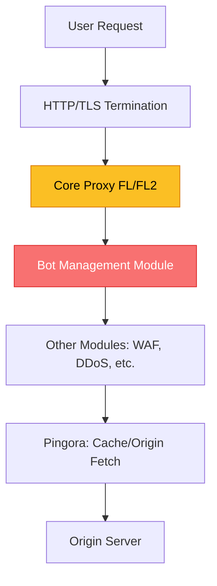
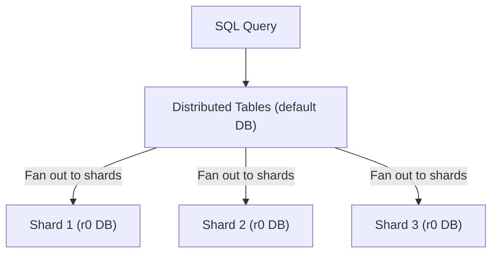

import Callout from '@/components/Callout.astro'

<Callout variant="tip">
**Part 1 of 3**: This is part of a series analyzing Cloudflare's November 18, 2025 outage. [← Back to Overview](/blog/cloudflare-outage-nov-2025) | [Part 2: Cascading Failures →](/blog/cloudflare-outage-nov-2025/cascading-failures)
</Callout>

## How Cloudflare Processes Requests

Every request to Cloudflare follows this path:



The **core proxy** runs various security and performance modules for each request. One of these modules, **Bot Management**, was the source of the outage.

## Bot Management's Machine Learning Model

Cloudflare's Bot Management uses an ML model to generate "bot scores" for every request traversing their network:

- **Bot Score**: 1-99 (1 = likely bot, 99 = likely human)
- **Usage**: Customers use scores to block/challenge/allow bots
- **Input**: A "feature" configuration file

### The Feature Configuration File

A "feature" is an individual trait used for prediction:
- Request header patterns
- Timing characteristics
- Behavioral signals
- IP reputation metrics

The feature file contains ~60 features normally. This file is:
- **Generated every 5 minutes** from a ClickHouse query
- **Rapidly deployed globally** to all edge servers
- **Critical for bot defense** (attackers evolve quickly)

**Why this matters**: Frequent, global deployment of machine-generated configs became the attack vector.

## ClickHouse Architecture: The Foundation

Understanding ClickHouse's distributed query system is critical to understanding the bug.

### Distributed Tables vs. Underlying Tables



- **`default` database**: Contains distributed tables (powered by `Distributed` table engine)
- **`r0` database**: Contains the actual shard tables where data lives
- Queries to distributed tables automatically fan out to all shards in `r0`

### The Permission Change at 11\:05

**Before**:  
Users querying metadata tables (like `system.columns`) only saw tables in the `default` database, even though they implicitly had access to `r0` tables.

**After the change**:  
Made `r0` table access explicit - users could now see metadata for both `default` AND `r0` tables.

**Goal**: Improve security by enabling fine-grained access grants and preventing one bad subquery from affecting others.

## The SQL Query Bug

The Bot Management feature generation code used this query to discover available features:

```sql
-- Problematic query
SELECT name, type 
FROM system.columns 
WHERE table = 'http_requests_features' 
ORDER BY name;
```

### What Changed in Query Results

**Before the permission change** (returns ~60 rows):
```
| name                    | type   | database |
|-------------------------|--------|----------|
| request_header_ua       | String | default  |
| request_method          | String | default  |
| request_path            | String | default  |
| client_ip               | String | default  |
... (~60 features total)
```

**After the permission change** (returns ~120 rows):
```
| name                    | type   | database |
|-------------------------|--------|----------|
| request_header_ua       | String | default  |
| request_header_ua       | String | r0       |  ← Duplicate!
| request_method          | String | default  |
| request_method          | String | r0       |  ← Duplicate!
| request_path            | String | default  |
| request_path            | String | r0       |  ← Duplicate!
... (~120+ rows - doubled!)
```

The query didn't filter by database name, so it returned features from both `default` and `r0` schemas.

### The Correct Query

```sql
SELECT name, type 
FROM system.columns 
WHERE database = 'default'  -- ← Missing filter!
  AND table = 'http_requests_features'
ORDER BY name;
```

**One line of SQL would have prevented the entire outage.**

## The 200-Feature Hard Limit

The Bot Management module has a hard limit: **maximum 200 features**.

**Why the limit exists**:  
Performance optimization. The module **preallocates memory** for features at startup:

```python
# Conceptual implementation
class BotManagementModule:
    MAX_FEATURES = 200  # Hard limit
    
    def __init__(self):
        # Preallocate memory for performance
        self.feature_storage = [None] * self.MAX_FEATURES
        self.feature_metadata = [None] * self.MAX_FEATURES
        
    def load_features(self, feature_file):
        features = parse_feature_file(feature_file)
        
        if len(features) > self.MAX_FEATURES:
            # What happens here determines the failure mode
            raise TooManyFeaturesError(
                f"Feature count {len(features)} exceeds limit {self.MAX_FEATURES}"
            )
```

**Normal operation**: ~60 features, leaving 140-feature buffer (233% headroom)

**After bad query**: 120+ features, only 80-feature buffer (67% headroom)

Eventually, as more features were added or query CONTINUED returning duplicates, the limit was breached.

## The Rust Panic

Here's the actual FL2 code that failed:

```rust
// Simplified FL2 proxy code
fn process_request(request: HttpRequest) -> Result<HttpResponse, Error> {
    // Load bot management configuration
    let bot_config = load_bot_config()?;
    
    // Load features from the configuration file
    let features = load_bot_features(&bot_config)?
        .unwrap();  // ← Called .unwrap() on Err!
    
    // Calculate bot score using features
    let bot_score = calculate_bot_score(&request, &features);
    
    // Continue processing...
    Ok(response)
}

fn load_bot_features(config: &BotConfig) -> Result<Option<Features>, Error> {
    let feature_file = read_feature_file(config.feature_file_path())?;
    let features = parse_features(&feature_file)?;
    
    // Validate feature count
    if features.len() > MAX_FEATURES {
        return Err(Error::TooManyFeatures {
            count: features.len(),
            max: MAX_FEATURES,
        });
    }
    
    Ok(Some(features))
}
```

**The Panic**:
```
thread fl2_worker_thread panicked: called Result::unwrap() on an Err value: 
Error::TooManyFeatures { count: 215, max: 200 }
```

### Why .unwrap() is Dangerous

In Rust, `.unwrap()` essentially says: "This should never fail, and if it does, crash immediately."

**Better error handling**:
```rust
let features = match load_bot_features(&bot_config)? {
    Some(f) => f,
    None => {
        // Graceful degradation
        log_error!("Failed to load features, using cached version");
        return use_cached_features_or_disable_bot_scoring();
    }
};
```

A single module failure shouldn't bring down the entire proxy. The Bot Management module should:
- Log the error
- Use cached features
- Or disable bot scoring and allow traffic through

## The Intermittent Failure Pattern

The outage didn't fail cleanly - it alternated between working and broken every 5 minutes.

### Why the Fluctuation?

1. **Feature file regenerated every 5 minutes** from the ClickHouse query
2. **Gradual ClickHouse cluster rollout**: Only some nodes had the new permissions
3. **Random query routing**: Each query hit either an updated node (bad) or non-updated node (good)

**Timeline**:
```
11\:20 ─[Good]─ Query hits non-updated node → 60 features → Network OK
11\:25 ─[Bad]── Query hits updated node → 120+ features → Panic!
11\:30 ─[Good]─ Query hits non-updated node → 60 features → Network OK
11\:35 ─[Bad]── Query hits updated node → 120+ features → Panic!
...
12\:30 ─[Bad]── All nodes updated → Always bad → Stable failure
```

This made diagnosis extremely difficult - the team initially thought it was an external attack because:
- Attacks often cause intermittent patterns
- Internal config issues usually fail consistently
- The 5-minute cycle suggested external timing

## Different Failure Modes: FL vs FL2

Cloudflare was migrating traffic from their old proxy (FL) to a new version (FL2). Both were affected, but differently:

**FL2 (new proxy)**: 
- Rust panic on feature count exceeded
- Returned HTTP 5xx errors
- Complete traffic failure for affected customers

**FL (old proxy)**:
- Different error handling
- Set all bot scores to **zero**
- Customers with "block bots" rules saw false positives (blocked legitimate traffic)
- But no 5xx errors

This difference created confusing symptoms - some customers saw 5xx errors, others saw bot-blocking issues.

## Why Machine-Generated ≠ Trusted

A critical assumption was violated: "Our code generates it, so it must be valid."

**The assumption**:
- We control the query
- We control the database
- Therefore, the output will always be correct

**The reality**:
- The environment changed (new permissions)
- The query had an implicit assumption (only default database visible)
- The assumption became invalid

**The lesson**: Treat machine-generated config files with the same validation as user input:

```python
def validate_feature_file(file_contents: bytes) -> Features:
    """Validate feature file before deployment."""
    features = parse_features(file_contents)
    
    # Validate count
    if len(features) > MAX_FEATURES:
        raise ValidationError(
            f"Too many features: {len(features)} > {MAX_FEATURES}"
        )
    
    # Check for duplicates
    feature_names = [f.name for f in features]
    if len(feature_names) != len(set(feature_names)):
        duplicates = find_duplicates(feature_names)
        raise ValidationError(f"Duplicate features: {duplicates}")
    
    # Validate file size (prevent memory issues)
    if len(file_contents) > MAX_FILE_SIZE:
        raise ValidationError(f"File too large: {len(file_contents)} bytes")
    
    # Validate feature schema
    for feature in features:
        if not feature.is_valid_schema():
            raise ValidationError(f"Invalid feature schema: {feature.name}")
    
    return features
```

This validation would have caught the issue immediately.

## Conclusion

The technical root cause was deceptively simple:
1. ClickHouse permission change made `r0` tables visible
2. SQL query lacked `WHERE database = 'default'` filter
3. Query returned duplicate rows, exceeding 200-feature limit
4. Rust code called `.unwrap()` on error, causing panic
5. HTTP 5xx errors for all traffic using Bot Management

The fix: **one line of SQL**.

The real lesson: **assumptions must be explicit**, **validation must be comprehensive**, and **graceful degradation should be the default**.

---

<Callout variant="tip">
**Continue Reading**: [Part 2: The Cascading Failures →](/blog/cloudflare-outage-nov-2025/cascading-failures)  
Learn how this technical failure cascaded through dependent services and why diagnosis took 3 hours.
</Callout>
