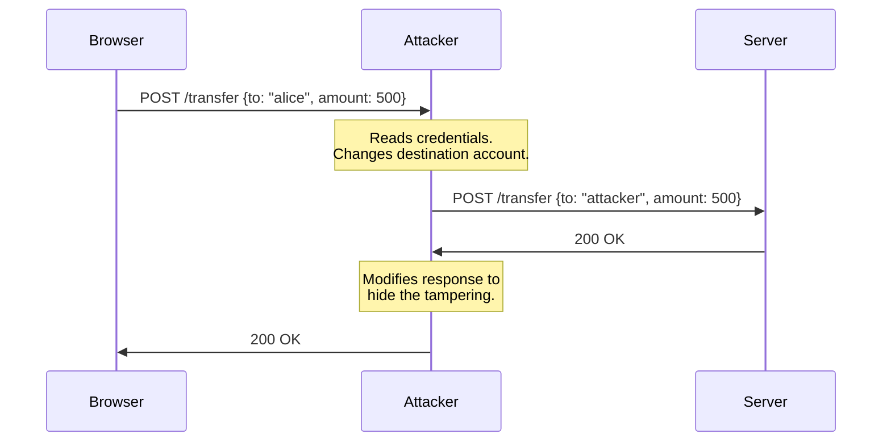

import Callout from '@/components/Callout.astro'
import FirstSubpost from '@/components/mdx/FirstSubpost.astro'

## The Problem with HTTP

HTTP sends everything in plaintext. Every header, every cookie, every request body travels across the wire as readable text. Consider what a login request looks like:

```http
POST /api/login HTTP/1.1
Host: bank.example.com
Content-Type: application/json

{"email": "user@example.com", "password": "hunter2"}
```

Anyone positioned between you and the server (your ISP, a rogue WiFi hotspot, a compromised router) can read this. They can also modify it in transit. The server has no way to verify the request arrived intact, and the client has no way to verify the response came from the real server.

This is not a theoretical problem. It is the design of the protocol. HTTP has no encryption, no integrity verification, and no authentication.

## Man-in-the-Middle Attacks

A **man-in-the-middle (MITM) attack** exploits this by inserting an attacker between the two communicating parties. The attacker intercepts traffic, reads or modifies it, and forwards it along. Neither side knows the attacker is there.



This can happen through ARP spoofing on a local network, DNS poisoning that redirects traffic to the wrong server, or BGP hijacking at the routing level. Tools for performing these attacks on open WiFi networks are freely available and require minimal skill to use.

**SSL stripping** is a particularly effective variant. The attacker intercepts an initial HTTP request (before any redirect to HTTPS) and proxies the connection: they maintain an HTTPS connection to the real server while serving the victim plain HTTP. The victim's browser shows no lock icon, but most users don't notice.

## What HTTPS Provides

HTTPS is simply HTTP sent over **TLS** (Transport Layer Security). The protocol stack looks like this:

```
Application Data (HTTP)
        ↓
      TLS
        ↓
      TCP
        ↓
       IP
```

TLS provides three guarantees:

| Guarantee | What it means |
|---|---|
| **Confidentiality** | Data is encrypted. Only the client and server can read it. |
| **Integrity** | Any modification to data in transit is detected. The connection is terminated if tampering occurs. |
| **Authentication** | The client can verify it is talking to the real server, not an impostor. |

## Certificates and the Chain of Trust

Authentication relies on **X.509 certificates**. A certificate binds a public key to an identity (a domain name) and is signed by a **Certificate Authority (CA)**.

Your browser ships with a trust store of roughly 150 root CA certificates. When a server presents its certificate during the TLS handshake, the browser verifies:

1. The certificate chain leads to a trusted root CA
2. The domain name matches the certificate's Subject Alternative Name (SAN)
3. The certificate has not expired
4. The certificate has not been revoked (checked via OCSP stapling or CRL)

If any check fails, the browser rejects the connection.

<Callout variant="note" title="Certificate Transparency">
Since 2018, all publicly trusted CAs must log every certificate they issue to public **Certificate Transparency (CT) logs**. This makes rogue or misissued certificates detectable. Major browsers reject certificates that do not appear in CT logs.
</Callout>

## What's Covered

This series breaks down HTTPS into three focused parts:

1. **[Glossary](/blog/https/glossary)**: Quick reference for every abbreviation and term used in this series.

2. **[TLS Handshake](/blog/https/tls-handshake)**: Step-by-step walkthrough of TLS 1.2 and TLS 1.3 handshakes with sequence diagrams, cipher suite anatomy, key derivation, and perfect forward secrecy.

3. **[Practical Considerations](/blog/https/practical-considerations)**: HSTS, TLS termination, certificate pinning, and other real-world deployment concerns.

<FirstSubpost />
