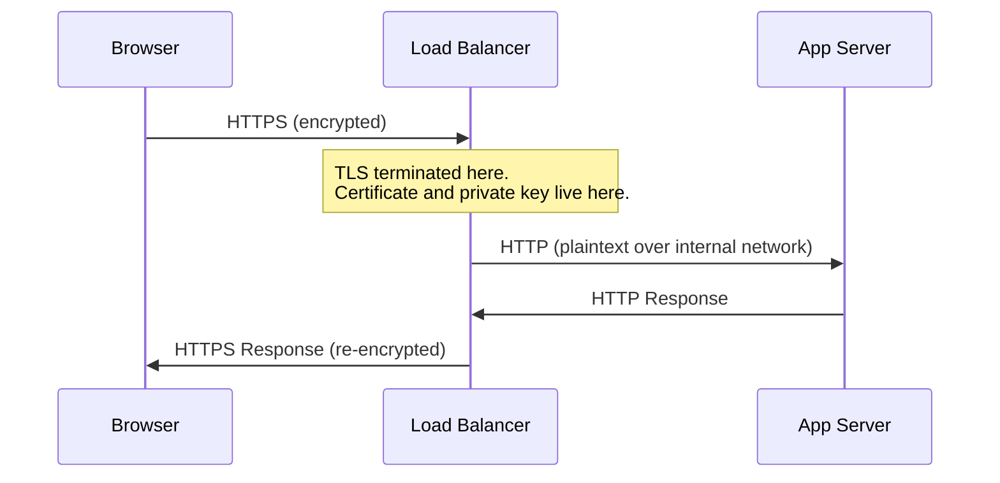

import Callout from '@/components/Callout.astro'

## HSTS

Even with HTTPS configured, a user typing `bank.example.com` in a browser first makes an HTTP request. An attacker performing SSL stripping can intercept that initial request.

**HTTP Strict Transport Security (HSTS)** closes this gap. The header tells browsers to always use HTTPS for this domain:

```http
Strict-Transport-Security: max-age=63072000; includeSubDomains; preload
```

- `max-age=63072000`: Remember for 2 years
- `includeSubDomains`: Apply to all subdomains
- `preload`: Opt into browser-hardcoded HSTS lists

Sites on the HSTS preload list (submitted to hstspreload.org) are hardcoded into Chrome, Firefox, Safari, and Edge. Even the very first visit uses HTTPS.

<Callout variant="warning" title="HSTS Preload is Permanent">
Removing a domain from the HSTS preload list takes months because it requires browser updates to propagate. Only enable preload if you are certain HTTPS will always work on your domain and all subdomains.
</Callout>

## TLS Termination

In production, TLS is rarely terminated at the application server. Instead, it is handled by a reverse proxy or load balancer (nginx, Cloudflare, AWS ALB).



This architecture means:

- The load balancer holds the TLS certificate and private key
- Traffic between the load balancer and backend is often unencrypted
- Your internal network must be trusted, or you need mutual TLS (mTLS) internally
- This should be explicitly documented in your threat model

In a system design interview, if you mention HTTPS, be prepared to explain where TLS terminates and what the security posture looks like between internal services.

## Certificate Pinning

Certificate pinning lets mobile apps reject any certificate that does not match a pre-configured hash, even if it was issued by a trusted CA.

**How it works**: The app stores the expected certificate's public key hash. During the TLS handshake, it compares the server's certificate against the stored hash. Mismatch = connection refused.

**Why it exists**: Protects against CA compromise. If a rogue CA issues a fraudulent certificate for your domain, pinned apps will reject it.

**The risk**: If the pinned certificate rotates and the app is not updated, connections break. This has caused real outages at companies that forgot to update pins before certificate expiration.

<Callout variant="tip">
**Modern alternative**: Certificate Transparency (CT) logs largely address the CA trust problem without the operational risk of pinning. Most teams today rely on CT monitoring rather than certificate pinning for new applications.
</Callout>

## mTLS (Mutual TLS)

Standard TLS only authenticates the server to the client. **Mutual TLS** adds client authentication: the server also verifies the client's certificate.

This is commonly used for:

- **Service-to-service communication** in microservices (each service has its own certificate)
- **Zero Trust architectures** where every connection must prove identity
- **API authentication** as an alternative to API keys

In a system design interview, mTLS is relevant when discussing internal service communication. If an interviewer asks "how do services authenticate each other?", mTLS is a strong answer alongside service mesh solutions like Istio or Linkerd that automate mTLS.

## SNI and Virtual Hosting

A single server IP can host TLS certificates for hundreds of domains using **Server Name Indication (SNI)**.

The client includes the target hostname in the ClientHello message (before encryption begins). The server reads this and selects the correct certificate.

**The privacy problem**: SNI is sent in plaintext. A network observer can see which domain you are connecting to, even though the content is encrypted. **Encrypted Client Hello (ECH)** is a TLS extension that encrypts the ClientHello to solve this, but adoption is still in progress.

## Summary

HTTPS is not just "add a certificate and you're done." Real-world deployment involves:

- **HSTS** to prevent SSL stripping on the first request
- **TLS termination** decisions that affect your internal security posture
- **Certificate management** including rotation, pinning tradeoffs, and CT monitoring
- **mTLS** for authenticating services in microservice architectures
- **SNI** for multi-domain hosting, with ECH for privacy

Understanding these concerns is what separates a surface-level answer from a strong one in system design interviews.