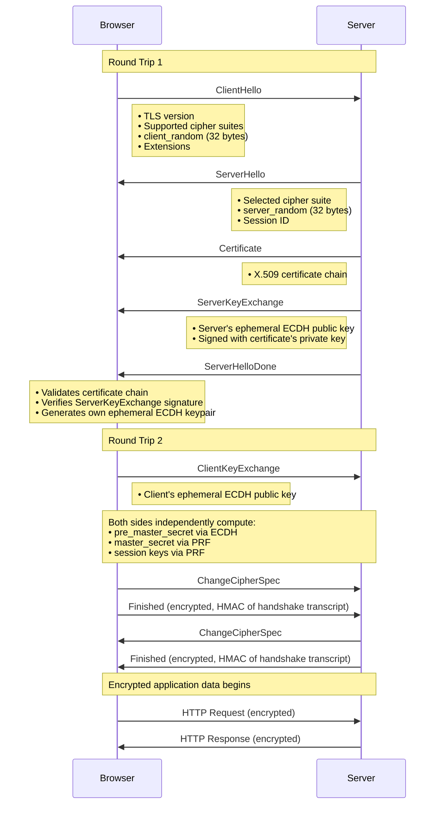
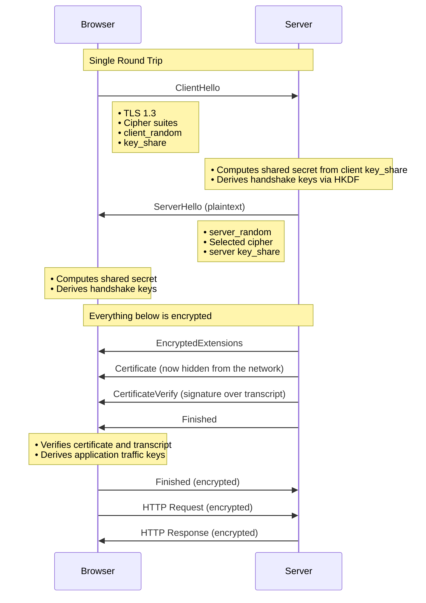

import Callout from '@/components/Callout.astro'

The TLS handshake happens before any application data is exchanged. Its job is to negotiate a cipher suite, authenticate the server, and derive shared encryption keys.

## Cipher Suite Anatomy

A TLS 1.2 cipher suite specifies four algorithms:

```
TLS_ECDHE_RSA_WITH_AES_256_GCM_SHA384
 │     │     │          │          │
 │     │     │          │          └─ PRF hash function
 │     │     │          └──────────── Bulk encryption (AEAD)
 │     │     └─────────────────────── Server authentication
 │     └───────────────────────────── Key exchange method
 └─────────────────────────────────── Protocol
```

TLS 1.3 simplified this. Cipher suites only specify the AEAD algorithm and hash, since forward-secret key exchange and certificate-based authentication are now mandatory. Example: `TLS_AES_256_GCM_SHA384`.

## TLS 1.2 Handshake

TLS 1.2 (RFC 5246) requires **two full round trips** before the first byte of HTTP data can be sent.



### Key Derivation

After exchanging ECDH public keys, both sides compute the same shared secret independently. Neither side ever transmits this value.

```
pre_master_secret = ECDH(my_private_key, their_public_key)

master_secret     = PRF(pre_master_secret,
                        "master secret",
                        client_random || server_random)

key_block         = PRF(master_secret,
                        "key expansion",
                        server_random || client_random)
                  = client_write_key + server_write_key + IVs
```

The `client_random` and `server_random` values ensure every session derives unique keys, even if the same ECDH parameters were reused.

### The Role of the Certificate

A critical distinction: the certificate's key pair does **not** encrypt any traffic. It only **authenticates** the server.

In the `ServerKeyExchange` message, the server signs its ephemeral ECDH public key using the certificate's private key. The client verifies this signature using the public key from the certificate. This proves the server is the legitimate owner of the domain, not an impostor generating their own ECDH keys.

<Callout variant="important" title="Perfect Forward Secrecy">
The `E` in `ECDHE` stands for **ephemeral**. Both sides generate fresh, temporary ECDH keys for every session and discard them when the session ends. If an attacker records your encrypted traffic and later compromises the server's long-term private key, they still cannot decrypt past sessions because the ephemeral keys no longer exist. This property is **perfect forward secrecy (PFS)**.
</Callout>

## TLS 1.3 Handshake

TLS 1.3 (RFC 8446, 2018) was a significant redesign that dropped legacy baggage and tightened the protocol.

### Key Differences from TLS 1.2

| Aspect | TLS 1.2 | TLS 1.3 |
|---|---|---|
| Handshake round trips | 2 RTT | 1 RTT |
| Certificate visibility | Plaintext on the wire | Encrypted |
| Forward secrecy | Optional (depends on cipher suite) | Mandatory |
| Key exchange | RSA or (EC)DHE | (EC)DHE only |
| Cipher types | AEAD and non-AEAD | AEAD only (AES-GCM, ChaCha20-Poly1305) |
| Removed algorithms | N/A | RSA key exchange, RC4, CBC, MD5, SHA-1, export ciphers |
| Key derivation | PRF-based | HKDF-based |

### The 1-RTT Handshake

The critical insight in TLS 1.3: the client sends its ECDH key share in the very first message. This lets the server derive keys immediately and encrypt everything after `ServerHello`, including the certificate.



Since the certificate is now sent encrypted, a passive observer on the network can no longer see which server the client is connecting to based on the certificate. SNI in the ClientHello still leaks this, but Encrypted Client Hello (ECH) addresses that separately.

<Callout variant="note" title="0-RTT Resumption">
TLS 1.3 also supports **0-RTT** resumption using pre-shared keys from a previous session. The client can send encrypted application data alongside the initial ClientHello, before the handshake completes.

The tradeoff: 0-RTT data has no replay protection. An attacker who captures the ClientHello can replay it, and the server may process the request twice. For this reason, 0-RTT should only be used for **idempotent** operations like GET requests, never for state-changing actions like payments or transfers.
</Callout>
