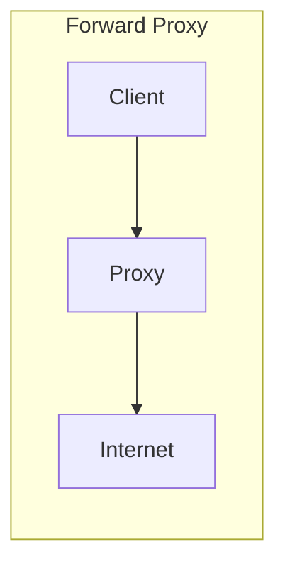
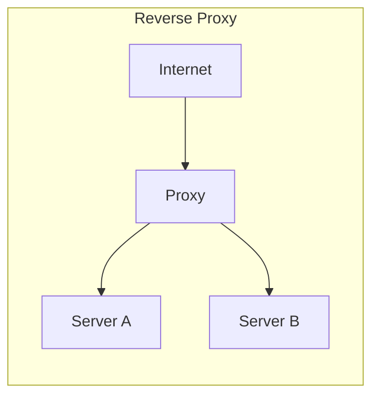
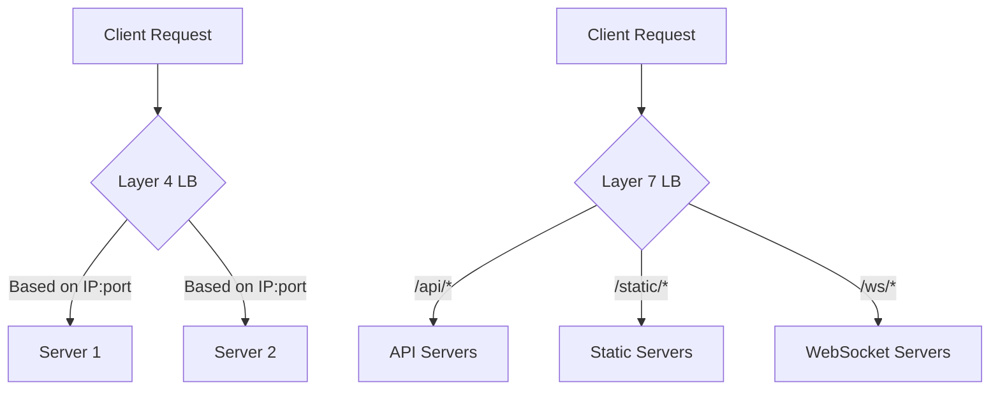
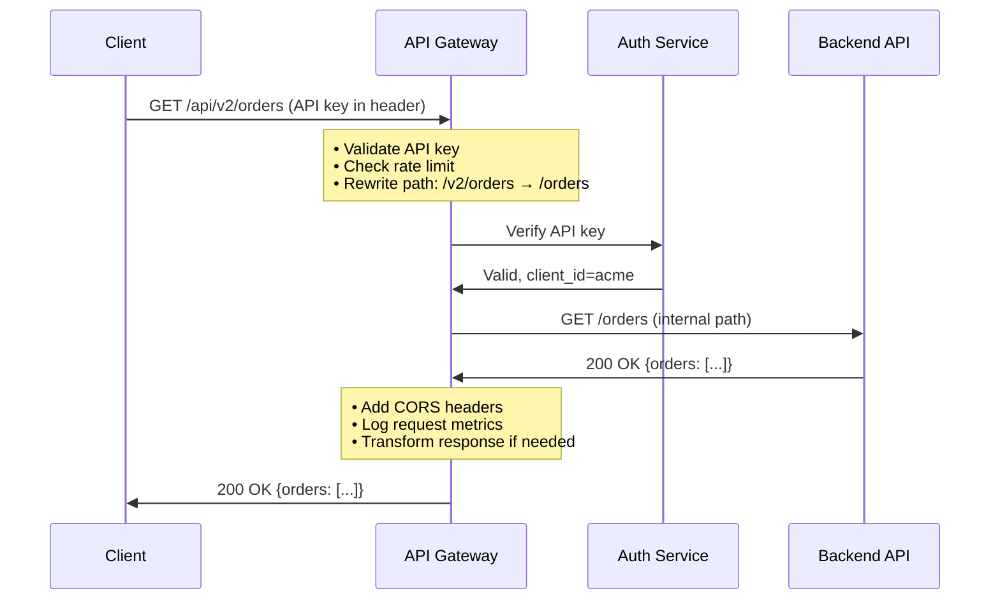
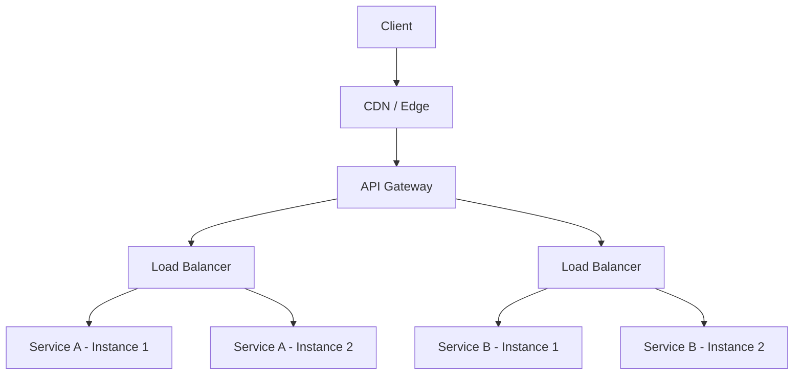

import Callout from '@/components/Callout.astro'

## Three Names, Overlapping Jobs

Reverse proxies, load balancers, and API gateways all sit between clients and backend servers. In practice, their responsibilities overlap significantly. Nginx can act as all three. AWS ALB is both a load balancer and a reverse proxy. Kong is an API gateway built on top of Nginx.

The distinction matters not because these are rigid categories, but because each represents a different **primary concern**. Understanding what problem each one solves helps you pick the right tool and explain your architecture clearly in a system design interview.

## Forward Proxy vs Reverse Proxy

Before diving in, let's clear up the direction.

A **forward proxy** sits in front of **clients**. It intercepts outbound requests from clients and forwards them to the internet. The server never sees the client's real IP.

A **reverse proxy** sits in front of **servers**. It intercepts inbound requests from the internet and forwards them to backend servers. The client never sees the backend server's real IP.

Forward proxies are used for outbound filtering (corporate firewalls, content filtering). For the rest of this post, we focus on reverse proxies and the components that build on them.

## Reverse Proxy

A reverse proxy accepts requests on behalf of backend servers and forwards them. The client only ever talks to the proxy.

### What it does

- **Hides backend topology**: Clients see a single endpoint. The number and addresses of backend servers are private.
- **TLS termination**: Handles certificate management and encryption/decryption so backends don't have to.
- **Compression and caching**: Can gzip responses and cache static content to reduce backend load.
- **Request routing**: Routes requests to different backends based on URL path, headers, or other criteria.
- **SSL offloading**: Decrypts HTTPS at the proxy and forwards plain HTTP internally.

### When you need one

- You have multiple backend services behind a single domain
- You want to terminate TLS in one place
- You want to add caching without modifying application code
- You want to hide your internal infrastructure from the internet

**Common tools**: Nginx, HAProxy, Caddy, Envoy, Traefik

## Load Balancer

A load balancer distributes incoming requests across multiple instances of the same service. Its primary concern is **even distribution** and **health management**.

### What it does

- **Distributes traffic**: Spreads requests across backend instances to prevent any single server from being overwhelmed.
- **Health checks**: Periodically probes backends and removes unhealthy ones from the pool.
- **Session affinity** (sticky sessions): Can route requests from the same client to the same backend when needed (e.g., for in-memory session state).
- **Connection draining**: When removing a server, finishes in-flight requests before taking it out of rotation.

### Load Balancing Algorithms

| Algorithm | How it works | Best for |
|---|---|---|
| **Round Robin** | Rotates through backends sequentially | Homogeneous servers, stateless services |
| **Weighted Round Robin** | Like Round Robin but servers with higher weight get more traffic | Mixed-capacity servers |
| **Least Connections** | Sends to the server with fewest active connections | Long-lived connections (WebSockets, streaming) |
| **IP Hash** | Hashes client IP to pick a consistent server | Session affinity without cookies |
| **Random** | Picks a random backend | Large pools where simplicity matters |

### Layer 4 vs Layer 7

Load balancers operate at two different network layers:

**Layer 4 (Transport)**: Makes routing decisions based on TCP/UDP information (IP address, port). Cannot inspect HTTP headers, URLs, or cookies. Faster because it doesn't parse the application protocol.

**Layer 7 (Application)**: Parses HTTP and can route based on URL path, headers, cookies, or request body. More flexible but adds processing overhead.

In system design interviews, default to **Layer 7** unless you have a specific reason for Layer 4 (like raw TCP proxying or extreme throughput requirements).

**Common tools**: AWS ALB/NLB, Nginx, HAProxy, Google Cloud Load Balancing, F5

<Callout variant="tip">
**Interview tip**: When asked "how do you handle millions of requests?", don't just say "add a load balancer." Specify the algorithm (likely Least Connections or Round Robin), whether it's L4 or L7, and how health checks remove failing instances.
</Callout>

## API Gateway

An API gateway is a reverse proxy with **application-level intelligence**. Its primary concern is managing, securing, and monitoring APIs.

### What it does

Everything a reverse proxy does, plus:

- **Authentication and authorization**: Validates JWT tokens, API keys, or OAuth flows before the request reaches your backend.
- **Rate limiting**: Enforces per-client or per-endpoint request limits.
- **Request/response transformation**: Modifies headers, rewrites paths, transforms payloads (e.g., XML to JSON).
- **API versioning**: Routes `/v1/users` and `/v2/users` to different backend services.
- **Analytics and logging**: Tracks API usage, latency, and error rates per consumer.
- **Circuit breaking**: Stops sending traffic to a failing backend after repeated errors.

### API Gateway vs Reverse Proxy

The key difference: an API gateway understands your **API contracts**. A reverse proxy forwards bytes. An API gateway understands that `/users/{id}` is a resource, can validate the request body against a schema, enforce rate limits per API key, and transform the response before returning it.

**Common tools**: Kong, AWS API Gateway, Apigee, Tyk, KrakenD

<Callout variant="note" title="Service Mesh vs API Gateway">
A **service mesh** (Istio, Linkerd) handles **east-west** traffic (service-to-service within your cluster). An API gateway handles **north-south** traffic (external clients to your services). They complement each other. In interviews, mention the API gateway for external traffic and the service mesh for internal mTLS, retries, and observability.
</Callout>

## Comparison

| Concern | Reverse Proxy | Load Balancer | API Gateway |
|---|---|---|---|
| **Primary job** | Forward and hide | Distribute and health-check | Manage and secure APIs |
| **TLS termination** | Yes | Yes | Yes |
| **Routing** | Path/host-based | Algorithm-based | Path + versioning + transformation |
| **Health checks** | Basic | Core feature | Yes |
| **Authentication** | No (usually) | No | Yes |
| **Rate limiting** | Basic | No | Yes |
| **Request transformation** | No | No | Yes |
| **Analytics** | Basic access logs | Connection metrics | Full API analytics |
| **Layer** | 7 | 4 or 7 | 7 |

## What to Use When

**Just need to hide backends and terminate TLS?** Use a reverse proxy (Nginx, Caddy).

**Need to distribute traffic across multiple instances of the same service?** Use a load balancer. If you're on AWS, ALB for HTTP or NLB for raw TCP.

**Exposing APIs to external consumers with auth, rate limiting, and versioning?** Use an API gateway (Kong, AWS API Gateway).

**In practice, you'll use multiple layers together:**

The API gateway handles cross-cutting concerns (auth, rate limiting, versioning). Behind it, load balancers distribute traffic to individual service instances.

<Callout variant="important" title="Interview Pattern">
In system design interviews, the standard pattern is: **Client -> CDN -> API Gateway/Load Balancer -> Services**. When drawing this, briefly mention what each layer does. Don't spend 5 minutes on load balancing algorithms unless the interviewer specifically asks.
</Callout>

## Summary

These three components solve different but overlapping problems:

- **Reverse proxy**: hides backends, terminates TLS, caches, compresses
- **Load balancer**: distributes traffic, manages health, drains connections
- **API gateway**: authenticates, rate-limits, transforms, versions APIs

Modern tools like Nginx, Envoy, and Kong blur these lines. The important thing is understanding which **concerns** apply to your system and choosing the right tool or combination.
