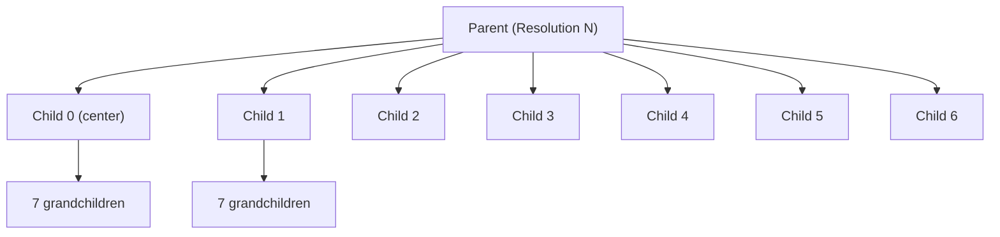

import Callout from '@/components/Callout.astro'

## The Multi-Resolution Hierarchy

H3's real power comes from its **multi-resolution hierarchy**. It's like a geospatial version of a B+ Tree, allowing you to zoom in and out seamlessly without recalculating coordinates.

Think of Google Maps: you can view the entire world, zoom to a country, then a city, then a street. H3 provides that same flexibility for data analysis.

## Resolution Levels

H3 provides 16 resolution levels (0-15), each with progressively smaller hexagons:

| Resolution | Avg Hexagon Edge | Avg Hexagon Area | Use Case |
|------------|------------------|------------------|----------|
| 0 | ~1,108 km | ~4,357,449 km² | Continent-level analysis |
| 3 | ~60 km | ~12,393 km² | Country-level regions |
| 5 | ~8 km | ~252 km² | City-level analysis |
| 7 | ~1.2 km | ~5.16 km² | Neighborhood analysis |
| 9 | ~175 m | ~0.105 km² | Street block level |
| 12 | ~9.4 m | ~0.0003 km² | Building-level precision |
| 15 | ~0.5 m | ~0.0000009 km² | Room-level accuracy |

<Callout variant="tip">
**Choosing Resolution**: For most applications, resolution 7-9 provides the sweet spot between accuracy and performance. Uber uses resolution 7 (~1km hexagons) for surge pricing.
</Callout>

### Why These Specific Sizes?

The resolution levels aren't arbitrary. Each level represents a **7x subdivision** of the previous level. This "aperture-7" system means:

- 1 parent hexagon = 7 children hexagons (1 center + 6 surrounding)
- Area decreases by ~7x at each resolution level
- Edge length decreases by ~√7 (≈2.65x) at each level

This exponential scaling allows you to quickly aggregate or drill down through massive datasets.

## Parent-Child Relationships

Each cell has **exactly 1 parent** at the next coarser resolution and **exactly 7 children** at the next finer resolution.



This hierarchy enables powerful operations:

### Aggregation (Roll Up)

Sum fine-grained data to coarser resolutions:

```python
# Count rides at resolution 9 (street blocks)
rides_res9 = {
  '8928308280bffff': 15,
  '8928308280cffff': 23,
  # ... millions more cells
}

# Aggregate to resolution 7 (neighborhoods)
rides_res7 = {}
for cell, count in rides_res9.items():
    parent = h3.h3_to_parent(cell, 7)
    rides_res7[parent] = rides_res7.get(parent, 0) + count
```

**Result**: Instantly create neighborhood-level heatmaps from street-level data.

### Drill Down (Zoom In)

Expand coarse cells to fine-grained children:

```python
# User clicks on a neighborhood (resolution 7)
neighborhood = '872830828ffffff'

# Show street-level detail (resolution 9)
street_blocks = h3.h3_to_children(neighborhood, 9)
# Returns 49 children (7 x 7 = 49, two levels down)
```

**Result**: Progressive disclosure—show overviews first, details on demand.

<Callout variant="important">
**Multi-Level Indexing**: You can store the same data at multiple resolutions. For example, maintain both resolution 7 (for city views) and resolution 9 (for neighborhood views) indexes simultaneously for instant zoom at any level.
</Callout>

## How H3 Works Under the Hood

Understanding the technical implementation helps you use H3 effectively and debug edge cases.

### Step 1: Icosahedron Projection

The Earth is a sphere. Hexagons tile flat surfaces. How do you reconcile this?

H3 uses a **geodesic discrete global grid system (DGGS)** based on an icosahedron:

1. **Project Earth onto an icosahedron** (20 equilateral triangular faces)
2. **Orient the icosahedron** so vertices (pentagons) fall in oceans when possible
3. **Subdivide each triangular face** into hexagons using an aperture-7 hierarchy

```
      /\          Icosahedron (20 triangular faces)
     /  \         Each face is subdivided into hexagons
    /____\        Vertices become pentagons (12 total)
   /\    /\
  /  \  /  \
 /____\/____\
```

**Why icosahedron?**
- 20 faces provide better approximation of a sphere than a cube (6 faces)
- Equilateral triangles minimize distortion
- Vertices can be strategically placed in oceans (less impact on land-based analysis)

<Callout variant="warning">
**Pentagon Locations**: Due to the icosahedron's 12 vertices, there are **12 pentagons** (5-sided cells instead of 6-sided) at each resolution. These are strategically placed in oceans when possible, but some resolutions have pentagons over land (Antarctica, Alaska). Always use H3 library functions to handle this automatically.
</Callout>

### Step 2: Coordinate Conversion

To convert a latitude/longitude coordinate to an H3 index:

```
1. Project (lat, lon) onto the icosahedron face
   - Determine which of the 20 triangular faces contains the point
   
2. Calculate face-local hexagonal coordinates
   - Transform from spherical to face's planar coordinate system
   - Use hex grid math to find which hexagon contains the point
   
3. Encode face + resolution + hex coordinates → 64-bit index
   - Bits represent: resolution + base cell + child positions
```

The resulting **H3 index** is a compact 64-bit representation:

- **Bits 0-3**: Resolution (0-15)
- **Bits 4-6**: Base cell (0-121, the resolution-0 hexagons)
- **Remaining bits**: Child cell position at each resolution level

Example: `8928308280bffff` encodes:
- `8` → Resolution 9
- `92830` → Base cell and navigation path
- `280bffff` → Specific child positions through the hierarchy

<Callout variant="tip" title="Index as Integer">
H3 indexes are 64-bit integers, making them extremely efficient to store, compare, and index in databases. They can be represented as hex strings (like `8928308280bffff`) for readability or as raw integers for performance.
</Callout>

### Step 3: Index Operations

Once you have H3 indexes, complex geospatial operations become **simple integer comparisons**.

**Proximity check without H3**:
```python
# Expensive: trigonometric haversine calculation for every pair
distance = haversine_distance(lat1, lon1, lat2, lon2)
if distance < 500:  # meters
    nearby = True
```

**Proximity check with H3**:
```python
# Cheap: integer comparison and set membership
h3_index1 = h3.geo_to_h3(lat1, lon1, 9)
h3_index2 = h3.geo_to_h3(lat2, lon2, 9)

if h3_index1 == h3_index2:
    nearby = True  # Same cell, definitely nearby!
elif h3_index1 in h3.k_ring(h3_index2, 1):
    nearby = True  # 1-hop neighbor
```

**Range query without H3**:
```python
# O(N) scan with expensive distance calculations
results = [p for p in points if distance(p, center) < 2000]
```

**Range query with H3**:
```python
# O(k) where k is number of hexagons in the radius
hex_cells = h3.polyfill(circle_boundary, resolution=9)
results = [p for p in points if p.h3_index in hex_cells]
# Then filter: only ~50 hexagons to check vs 1M points!
```

The speedup comes from **reducing complex geometric calculations to simple set membership tests**.

<Callout variant="tip">
**Performance Boost**: For a 2km radius query over 1M points, H3 can reduce computation from ~1M distance calculations to checking ~50 hexagons — a **20,000x speedup**.
</Callout>

## Why the Hierarchy Matters

The hierarchical structure isn't just a nice-to-have—it enables fundamentally different types of analysis:

### 1. Efficient Zoom Interfaces

Build interactive maps that respond instantly at any zoom level:
- Show continent data at resolution 3
- City data at resolution 7
- Street data at resolution 9
- **No recalculation needed**—just query the appropriate resolution index

### 2. Privacy-Preserving Analytics

Share location data without revealing exact addresses:
- Instead of: "User at 37.7749°N, 122.4194°W"
- Share: "User in H3 cell 872830828ffffff" (resolution 7 ≈ 5km²)
- Still enables aggregate analysis while protecting individual privacy

### 3. Multi-Scale Spatial Joins

Join datasets at different resolutions efficiently:

```python
# Restaurant locations at resolution 10 (building-level)
restaurants = get_restaurants_with_h3()

# Customer locations at resolution 9 (street-level)
customers = get_customers_with_h3()

# Find customers near each restaurant
for restaurant in restaurants:
    # Convert to resolution 9 for comparison
    restaurant_cell_res9 = h3.h3_to_parent(restaurant.h3_index, 9)
    nearby_cells = h3.k_ring(restaurant_cell_res9, 2)
    
    nearby_customers = [c for c in customers if c.h3_index in nearby_cells]
```

### 4. Time-Series Aggregation

Track how spatial patterns change over time at any resolution:

```sql
-- Hourly ride counts by neighborhood (resolution 7)
SELECT 
  h3_index,
  DATE_TRUNC('hour', timestamp) as hour,
  COUNT(*) as ride_count
FROM rides
WHERE h3_index_res7 IN (downtown_hexagons)
GROUP BY h3_index, hour
ORDER BY hour;
```

## Conclusion

H3's hierarchical structure transforms geospatial data from a continuous coordinate problem into a discrete, hierarchical indexing system. The multi-resolution grid allows you to:

- Aggregate and drill down seamlessly
- Choose the right granularity for your use case
- Perform spatial operations as fast integer comparisons

Understanding the icosahedron projection and 64-bit encoding helps you debug edge cases (like pentagons) and optimize your queries.

Next, let's explore the **[H3 Operations](/blog/uber-h3/h3-operations)** you can perform with this powerful indexing system.
